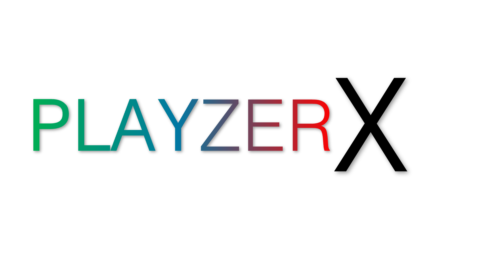
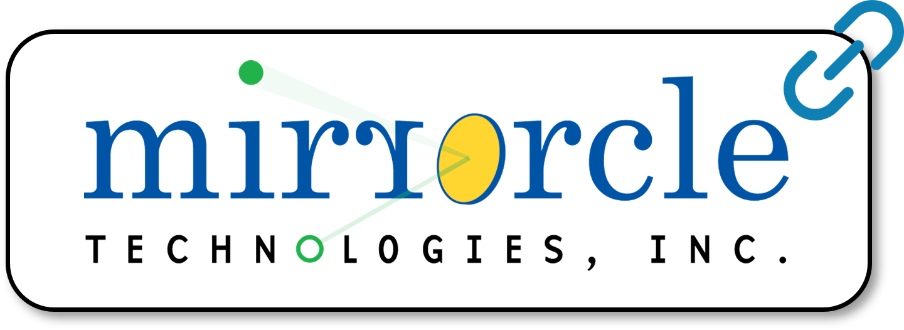

# playzerx 

The Playzer X-Series (or “PlayzerX”) provides developers, makers, engineers,
and students easy access to Playzer technology and its underlying VGLP
architecture on the platform of their choice. It provides both the option to
control the laser beam by external controllers via Analog Inputs, and the option
to control the laser beam by software via USB.

- Monochrome Playzer X-Series, Part Numbers: PX1-[R/G/B/V]
- RGB Playzer X-Series, Part Number: PX1-RGB

Playzer X is available directly from Mirrorcle by contacting sales@mirrorcletech.com, or from DigiKey (links below)

  
  

## Quick start

## Overview 

PlayzerX provides ease-of-access to the Playzer product line and VGLP architecture. The purpose of its simple analog or USB interface is to provide programmable beam steering.

With very low power consumption, devoted mostly to the supply of the laser driver, and with a highly compact mechanical profile, Playzer X-Series is well-suited for the development of many laser pointing applications. Users command x-axis and y-axis angle of the Scan Module laser beam as well as output laser power of the beam. 

Playzer X-Series provides simplified control of MEMS Mirror and Laser Beam with multiple interface modes:
- Analog Input
- USB (user switches to this Interface Mode with USB commands)

For full specifications including the optical scanning angle (field of regard), laser power, and point-to-point scanning bandwidth,
please see the [Mirrorcle Playzer X-Series - User Guide](https://mirrorcletech.com/pdf/PX/Mirrorcle_Playzer_X-Series_-_User_Guide.pdf).

## Associated papers and application notes 

Lovell, Daniel, et al. "Optical MEMS enable next generation solutions for robot vision and human-robot interaction." MOEMS and Miniaturized Systems XXI. Vol. 12013. SPIE, 2022. [Link to PDF](https://mirrorcletech.com/pdf/pub/Mirrorcle_-_Optical_MEMS_enable_next_generation_solutions.pdf)

Kasturi, Abhishek, et al. "MEMS mirror module for programmable light system." MOEMS and Miniaturized Systems XVIII. Vol. 10931. SPIE, 2019. [Link to PDF](https://www.mirrorcletech.com/pdf/pub/Mirrorcle_-_MEMS_Mirror_Module_for_Programmable_light_System.pdf)

