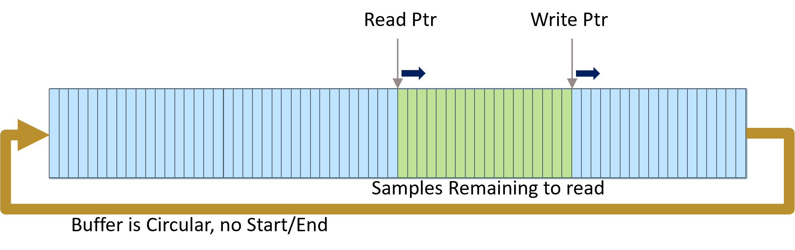

.. _playzerx-guide:

PlayzerX Programming Guide
==========================

This guide provides a comprehensive overview of how to use the **PlayzerX** C++ API. ``PlayzerX`` is a versatile Vector Graphics Laser Projection system. 
This C++ API allows users to initialize and discover PlayzerX devices, connect via serial, configure essential parameters, and send real-time data for scanning or display.

.. contents::
   :local:
   :backlinks: none

Basic Hardware Setup and Data Flow
-----------------------------------

When using a PlayzerX Module in USB mode, the Controller's buffer is configured as a circular FIFO buffer. 
The total buffer size is **125,000 samples** for the Monochrome version and **83,333 samples** for the RGB version.

The Controller continuously operates in reading mode (outputting samples) as long as there are samples available to read, 
meaning the Read Pointer has not caught up with the Write Pointer. The reading timing, or the movement of the Read Pointer, is
determined by the SampleRate, which can be set using the :cpp:func:`playzerx::PlayzerX::SetSampleRate` command (default is 22,000 samples per second).

The writing timing, on the other hand, depends on the data provided by the user over the serial port and can reach up to
approximately 50,000 samples per second. The USB data rate can vary between 500 KB/s and 625 KB/s, but overhead in the API and OS 
can set the upper limit on the actual data rate. This is achieved using the :cpp:func:`playzerx::PlayzerX::SendData` commands. 
Before writing new data, users should typically check the :cpp:func:`playzerx::PlayzerX::GetSamplesRemaining` value to ensure that the buffer requires new data and that there is
sufficient space for it.

Initialize, Search, and Connect
--------------------------------

Initialize the API
^^^^^^^^^^^^^^^^^^

.. note::
   Before using PlayzerX, ensure you have set up your environment, compiler, and acquired the necessary drivers or libraries.  
   Refer to the PlayzerX Quickstart Guide if you are unsure of these prerequisites.

Create a :cpp:class:`playzerx::PlayzerX` device instance by calling :cpp:func:`playzerx::PlayzerX::CreateDevice`:

.. code-block:: cpp

   #include "PlayzerX.h"

   using namespace playzerx;

   int main()
   {
       // Create the PlayzerX device object
       PlayzerX* playzer = PlayzerX::CreateDevice();

       // ...
       // Additional code here
       // ...

       // Finally, clean up
       PlayzerX::DeleteDevice(playzer);
       return 0;
   }

The returned pointer is used to call other PlayzerX API functions for device discovery, data streaming, etc.

Search for Devices
^^^^^^^^^^^^^^^^^^

Scan for connected devices and (if desired) present these to the user, letting them pick the target device. 
All detected PlayzerX devices, including basic metadata, can be retrieved using :cpp:func:`playzerx::PlayzerX::GetAvailableDevices`.

The structure :cpp:class:`playzerx::PlayzerXAvailableDevices` stores relevant information:

- Number of devices found (:cpp:member:`playzerx::PlayzerXAvailableDevices::NumDevices`)
- Device names
- Firmware strings
- Associated COM port numbers/names

You can optionally display a list of all discovered devices in the console with :cpp:func:`playzerx::PlayzerX::ListAvailableDevices`.

.. code-block:: cpp

   #include "PlayzerX.h"
   using namespace playzerx;

   int main()
   {
       PlayzerX* playzer = PlayzerX::CreateDevice();

       PlayzerXAvailableDevices devTable;
       playzer->GetAvailableDevices(devTable);
       playzer->ListAvailableDevices(devTable);

       PlayzerX::DeleteDevice(playzer);
       return 0;
   }

If you already know the COM port (e.g. "COM4" on Windows or "/dev/ttyUSB0" on Linux), you do not necessarily need to do this step.

Connect to a Device
^^^^^^^^^^^^^^^^^^^

Once you have obtained information about available devices or already know the COM port, you can connect to your target device by using one of the overloaded :cpp:func:`playzerx::PlayzerX::ConnectDevice` methods:

- **ConnectDevice()**  
  Connects automatically to the first available port found.

  .. code-block:: cpp

     PlayzerX* playzer = PlayzerX::CreateDevice();
     // Connect to the first discovered device
     playzer->ConnectDevice();

- **ConnectDevice(const std::string &portName)**  
  Connects to a specific port name (e.g. "COM5" or "/dev/ttyUSB0").

  .. code-block:: cpp

     PlayzerX* playzer = PlayzerX::CreateDevice();
     // Connect to COM5 on Windows (or "/dev/ttyUSB0" on Linux)
     playzer->ConnectDevice("COM5");

- **ConnectDevice(char* portName)**  
  C-style version for connecting to a specified port name.

All these methods open the specified COM port and attempt to initialize PlayzerX device communication.

Error Handling
^^^^^^^^^^^^^^

After an operation, you can check for errors by calling :cpp:func:`playzerx::PlayzerX::HasError`. 
Internally, the class sets :cpp:member:`playzerx::PlayzerX::m_LastError` of type :cpp:enum:`playzerx::PlayzerXError`.

Possible error codes include:

- :cpp:enumerator:`playzerx::PlayzerXError::SUCCESS`
- :cpp:enumerator:`playzerx::PlayzerXError::ERROR_CONNECTION`
- :cpp:enumerator:`playzerx::PlayzerXError::ERROR_INVALID_PARAM`
- :cpp:enumerator:`playzerx::PlayzerXError::ERROR_GENERAL`

Example:

.. code-block:: cpp

   if (playzer->HasError())
   {
       // Retrieve the error code
       PlayzerXError errCode = playzer->GetLastError();
       // Take appropriate action
   }
   else
   {
       // Continue normal operation
   }

Device Configuration
--------------------

For users familiar with the Mirrorcle MTIDevice API, the PlayzerX device is a little different in that it does not store a
comprehensive parameter structure that is read/written in a single block (such as `MTIDeviceParams`). 
Instead, **PlayzerX** individually sets or queries various operational parameters or device info. 
Below are some of the most important device configuration functions:

Get Device Information
^^^^^^^^^^^^^^^^^^^^^^

Use :cpp:func:`playzerx::PlayzerX::GetDeviceInfo` to query device name, firmware name, and data format.

- :cpp:var:`playzerx::PlayzerX::m_DeviceName` – textual description of the device
- :cpp:var:`playzerx::PlayzerX::m_FirmwareName` – firmware identifier
- :cpp:var:`playzerx::PlayzerX::m_DataFormat` – e.g. "XYM" or "XYRGB"

.. code-block:: cpp

   if (playzer->GetDeviceInfo())
   {
       std::string devName = playzer->GetDeviceName();
       std::string fwName  = playzer->GetFirmwareName();
       std::string dataFmt = playzer->GetDataFormat();

       // Possibly check if the device is RGB capable
       bool isRGB = (dataFmt == "XYRGB");
   }

Set Sample Rate
^^^^^^^^^^^^^^^

Use :cpp:func:`playzerx::PlayzerX::SetSampleRate` to set the output sampling frequency (in samples/second). Acceptable range is typically from 200 to 50,000.

.. code-block:: cpp

   // Set sample rate to 10 kS/s
   playzer->SetSampleRate(10000);

Note that the device will clamp out-of-range values to its valid minimum or maximum.

Set Buffer Update Timer
^^^^^^^^^^^^^^^^^^^^^^^

Use :cpp:func:`playzerx::PlayzerX::SetBufferUpdateTimer` to enable or disable automatic buffer-level feedback from the device. Setting this timer to a non-zero value triggers streaming of "remaining samples" info from the device at the specified interval (milliseconds).

.. code-block:: cpp

   // Enable buffer updates every 100ms
   playzer->SetBufferUpdateTimer(100);

   // Disable buffer updates
   playzer->SetBufferUpdateTimer(0);

Content Generation and Execution
--------------------------------

Overview of Output Operation
^^^^^^^^^^^^^^^^^^^^^^^^^^^^

All user-supplied X/Y coordinate data typically lies within the normalized range of [-1, +1].
For **PlayzerX**, the device automatically converts these normalized positions into hardware-level signals.

Depending on the device data format (e.g., XYM vs. XYRGB), you may also supply an 8-bit laser modulation value (`m` for intensity) or three 8-bit color values (`r`, `g`, `b` for red, green, blue).

You can continuously stream data for scanning patterns or you can send point-by-point updates for slower positioning. The main content-sending methods are:

- :cpp:func:`playzerx::PlayzerX::SendDataXY`  
- :cpp:func:`playzerx::PlayzerX::SendDataXYM`  
- :cpp:func:`playzerx::PlayzerX::SendDataXYRGB`  

In code, these functions take pointers (or vectors) to X, Y, and optionally M or R/G/B arrays, along with the number of samples, and an optional buffer-level parameter. See the PlayzerX header for exact signatures.

All these methods optionally take a *bufferLevelToSend* parameter, which allows the internal buffer to be partially emptied before sending new data. This can help avoid jumps in output while streaming.

Point-to-Point or Single Sample
^^^^^^^^^^^^^^^^^^^^^^^^^^^^^^^

You can move to a single (x, y) or (x, y, m) or (x, y, r, g, b) point by sending just **1 sample**. For instance:

.. code-block:: cpp

   // Move to X=0.3, Y=-0.4, with M=128 (laser half-power)
   playzer->SendDataXYM(0.3f, -0.4f, 128);

   // Or, for an XY-only device (no laser intensity):
   playzer->SendDataXY(0.3f, -0.4f);

   // For an RGB-capable device:
   // R=255, G=128, B=0 -> Orange color
   playzer->SendDataXYRGB(0.3f, -0.4f, 255, 128, 0);

Send a Stream of Samples
^^^^^^^^^^^^^^^^^^^^^^^^

Typically, scanning-based applications require a large buffer of points (e.g. waveforms, images, shapes). With **PlayzerX**, you create arrays or vectors for X, Y, and possibly M or RGB. Then call one of the streaming methods:

.. code-block:: cpp

   const unsigned int nSamples = 3000;
   std::vector<float> xData(nSamples), yData(nSamples);
   std::vector<unsigned char> mData(nSamples);

   // Fill xData, yData, mData with your pattern or shape...
   // e.g., a basic lissajous or some custom shape

   // Then send the data
   playzer->SendDataXYM(xData, yData, mData);

If the device is already running a previously streamed pattern, it will switch over after finishing the old buffer or once enough buffer space becomes available.

Monitoring and Waiting for Buffer Level
^^^^^^^^^^^^^^^^^^^^^^^^^^^^^^^^^^^^^^^

:cpp:func:`playzerx::PlayzerX::WaitForBufferLevel` blocks your code until the device's buffer usage reaches (drops below) a specified threshold. This can be used to synchronize with the scanning, to prevent buffer overflows:

.. code-block:: cpp

   // Wait until only 500 samples remain before sending more
   playzer->WaitForBufferLevel(500);

   // Next chunk of data
   playzer->SendDataXYM(xChunk, yChunk, mChunk, chunkSize);

Clearing the Buffer
^^^^^^^^^^^^^^^^^^^

If you need to reset or clear all points from the device’s buffer, call :cpp:func:`playzerx::PlayzerX::ClearData`:

.. code-block:: cpp

   // Stop scanning immediately and flush device buffer
   playzer->ClearData();

Additional Data Formats
^^^^^^^^^^^^^^^^^^^^^^^

If your device (firmware) sets :cpp:var:`playzerx::PlayzerX::m_RGBCapable` to true, you can use RGB scanning:

.. code-block:: cpp

   // Example for an RGB device
   unsigned int length = 500;
   std::vector<float> x(length), y(length);
   std::vector<unsigned char> r(length), g(length), b(length);

   // fill data...

   playzer->SendDataXYRGB(x, y, r, g, b, length);

Example Scanning Demo
---------------------

This section reproduces the **ScanningDemo** function **exactly** as it appears in ``PlayzerX-Demo``. It demonstrates generating a Lissajous pattern and continuously sending data to the controller until the user presses a key.

.. code-block:: cpp

   // ScanningDemo demonstrates basic content generation and execution functions
   // This demo prepares a lissajous pattern, then sends the data to the Controller
   void ScanningDemo() {
       int i = 0, j = 0, k = 0, key, npts = 256 * 40;
       float *x, *y, dt = (float)M_PI * 2.f / npts;
       unsigned char* m;

       // Sample rate and number of points equal, so 1 second of data
       // in one repeated frame.
       playzer->SetSampleRate(npts);

       printf("\nStarting scanning demo...\n\n");

       // Create some sample data
       x = new float[npts];
       y = new float[npts];
       m = new unsigned char[npts];
       while (true) {
           if (j > 0) {
               if (!_kbhit()) continue;
               key = _getch();
               if (key == 224)
                   continue;
               else if (key == 27)
                   break;
           }
           k = j % 8 + 1; // integer that changes every iteration to generate different Lissajous patterns.

           // Prepare 1 second of data to be repeated
           for (i = 0; i < npts; i++) {
               // X-axis position follows a sin curve from -1.0 to +1.0 (normalized)
               x[i] = sin(10.f * k * i * dt);

               // Y-axis position follows a sin curve from -0.9 to +0.9 at another frequency
               y[i] = 0.9f * sin((5.f * (k + 1) + 1) * i * dt);

               // 8-bit laser modulation (0..255)
               // Here it increases every four samples in a 100-value range
               m[i] = (unsigned char)(156 + (i / 4) % 100);
           }

           // Send data to the controller repeatedly until user input is detected
           do {
               // The call below downloads the entire buffer to the device and
               // starts running it after the current frame ends.
               playzer->SendDataXYM(x, y, m, npts, 10000);
           } while (!_kbhit());

           printf("Cycle: %d. Press any key to change waveform or ESC to exit demo...\n", ++j);
       }

       // Reset beam to center with laser at lowest power
       playzer->SendDataXYM(0, 0, 0);

       SAFE_DELETE_ARRAY(x);
       SAFE_DELETE_ARRAY(y);
       SAFE_DELETE_ARRAY(m);
   }

Observations
^^^^^^^^^^^^
- The function uses :cpp:func:`SetSampleRate` to match the number of points (`npts`) to the sampling frequency, effectively setting up a 1-second cycle.
- The main (`while (true)`) demo loop regenerates a new Lissajous pattern each time the user presses a key,
  slightly varying the frequencies for each cycle via the integer `k`.
- An additional `while (!_kbhit())` loop repeatedly sends the same data buffer to the device, so the controller scans those points continuously until a new key is detected.
- Finally, pressing <ESC> exits the loop and sends a single `(x=0, y=0, m=0)` sample to turn off the beam and move the beam to the center.

Understanding the Effect of Sample Rate and Number of Points
^^^^^^^^^^^^^^^^^^^^^^^^^^^^^^^^^^^^^^^^^^^^^^^^^^^^^^^^^^^^^

Below are three example GIFs illustrating how the entire buffer of samples is processed over time by the Controller during the `ScanningDemo` function. 
These visualizations show:

- **Green** point is the *current* sample.
- **Blue** points are samples that have *already been output*.
- **Red** points are the remaining samples in the buffer that will be output next.

We observe how reducing the number of points (`npts`) or changing the sample rate affects the effective “speed” at which the pattern is drawn:

   **512 Points, "Faster" Sample Rate**  
   Fewer points in the buffer means each pass is completed more quickly, increasing the perceived refresh or precession rate.

   **1024 Points, "Faster" Sample Rate**  
   Twice as many points as the 512 case but at the same sample rate, slowing the scan cycle.

   **1024 Points, "Slower" Sample Rate**  
   The same buffer size as above, but at a slower sample rate, further reducing the Lissajous precession.

1. **512_faster** vs. **1024_faster**:

Both use the same (relatively high) sample rate. However, the version with only **512 points** in its buffer
completes the cycle *sooner* (higher refresh or precession rate).  
The one with **1024 points** has *twice* as many samples in its buffer, so it takes longer to complete one cycle at the same sample rate, thus the pattern animates more slowly.

2. **1024_faster** vs. **1024_slower**:

Both have **1024 points** in the buffer. By reducing the sample rate (from "faster" to "slower"), the device 
traverses these 1024 samples at a slower pace, making the Lissajous figure look less frantic and reducing its precession rate.

.. warning::
   **Mechanical resonance and ringing:**

   When the number of samples you send to the PlayzerX device is small but you maintain a very high sample rate (e.g., the **512_faster** scenario),
   the waveform can become more sparse or “jagged.”

   The MEMS mirror inside PlayzerX is a high-Q spring-mass system, so large, rapid excursions can lead to ringing. 
   A low-pass filter (LPF) on the Controller helps mitigate this effect, but users should be aware that low
   `npts` + high `sample rate`  can stress the system or cause overshoot in the mirror's physical response. 
   This typically manifests as a "ringing" effect in the waveform.

Debug and Status Queries
------------------------

Check Samples Remaining
^^^^^^^^^^^^^^^^^^^^^^^

:cpp:func:`playzerx::PlayzerX::GetSamplesRemaining` retrieves how many points are still in the device’s internal buffer waiting to be executed:

.. code-block:: cpp

   int remaining = playzer->GetSamplesRemaining();
   if (remaining < 0)
   {
       // Possibly an error or misalignment
   }
   else
   {
       // ...
   }

Check Device Running / Connected
^^^^^^^^^^^^^^^^^^^^^^^^^^^^^^^^

- :cpp:func:`playzerx::PlayzerX::IsDeviceConnected` returns ``true`` if an active serial connection is open and responding.
- For advanced usage, you can see if data is actively being processed by checking if the buffer is not empty, or by user-defined logic.

Clearing and Resetting Communication
^^^^^^^^^^^^^^^^^^^^^^^^^^^^^^^^^^^^

- :cpp:func:`playzerx::PlayzerX::PurgeSerialBuffers` flushes any inbound/outbound data.
- If communication becomes unresponsive, or if the USB cable was briefly unplugged, you may attempt to reconnect.

Example:

.. code-block:: cpp

   if(!playzer->IsDeviceConnected())
   {
       // Possibly re-init or re-connect
       playzer->DisconnectDevice();
       playzer->ConnectDevice();
   }

   // Clear stale data from the buffers
   playzer->PurgeSerialBuffers();

Disable and Disconnect
----------------------

Disable Outputs
^^^^^^^^^^^^^^^

Before turning off or disconnecting the application, you might want to ensure that the scanning output is idle and the laser is turned off:

.. code-block:: cpp

   // Move the beam to center with no laser power (XYM device)
   playzer->SendDataXYM(0.f, 0.f, 0);

   // Or just clear all data from the device buffer
   playzer->ClearData();

Disconnect Device and Cleanup
^^^^^^^^^^^^^^^^^^^^^^^^^^^^^

To properly close the connection and free resources, call:

.. code-block:: cpp

   // 1) Disconnect the device (close COM port)
   playzer->DisconnectDevice();

   // 2) Delete the PlayzerX object
   playzerx::PlayzerX::DeleteDevice(playzer);

This releases the serial port handle and all associated memory. Your application can then exit cleanly.

Full Demo Example
-----------------

Below is a condensed excerpt of the **PlayzerX-Demo** application showing initialization, device connection, and scanning loop. For the complete example, refer to the ``PlayzerX-Demo`` source file.

.. code-block:: cpp

   #include "PlayzerX.h"
   #include <iostream>
   #include <conio.h>

   using namespace playzerx;

   int main(int argc, char* argv[])
   {
       // Create device
       PlayzerX* playzer = PlayzerX::CreateDevice();

       // Connect to device (first available)
       playzer->ConnectDevice();
       if (playzer->HasError())
       {
           std::cerr << "Could not connect to any PlayzerX device!" << std::endl;
           PlayzerX::DeleteDevice(playzer);
           return -1;
       }

       // Retrieve basic info
       playzer->GetDeviceInfo();
       std::cout << "Device Name:    " << playzer->GetDeviceName() << std::endl;
       std::cout << "Firmware Name:  " << playzer->GetFirmwareName() << std::endl;
       std::cout << "Data Format:    " << playzer->GetDataFormat() << std::endl;

       // A simple scanning test
       unsigned int npts = 1000;
       playzer->SetSampleRate(npts);
       std::vector<float> xData(npts), yData(npts);
       std::vector<unsigned char> mData(npts);

       // Fill X/Y arrays with a small pattern (e.g., circle)
       for(int i=0; i<(int)npts; i++)
       {
           float t = float(i) * 6.2831853f / float(npts);
           xData[i] = std::cos(t);
           yData[i] = std::sin(t);
           mData[i] = (unsigned char)(128 + 127 * std::sin(4.0f*t));
       }

       std::cout << "Press any key to start scanning circle pattern...\n";
       _getch();

       // Send data repeatedly until user presses a key
       while(!_kbhit())
       {
           // Wait for free buffer space
           playzer->WaitForBufferLevel(500);
           playzer->SendDataXYM(&xData[0], &yData[0], &mData[0], npts);
       }

       // Clean exit
       playzer->SendDataXYM(0.f, 0.f, 0);
       playzer->DisconnectDevice();
       PlayzerX::DeleteDevice(playzer);

       return 0;
   }

Next Steps
----------

Refer to the provided **PlayzerX-Demo** for a comprehensive, interactive example illustrating device setup, basic scanning, advanced audio-driven waveforms, 
and user-controlled interactive demos. Be sure to handle error conditions gracefully, disable outputs when not in use, and properly disconnect the device upon completion.
