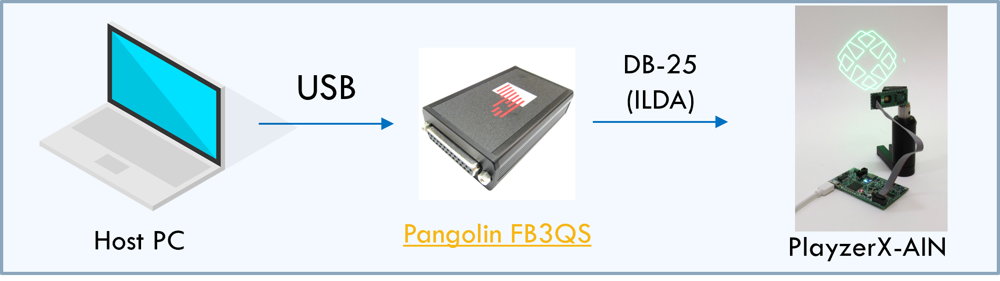

PlayzerX Documentation
======================

.. raw:: html

   

.. raw:: html

   

     
     
     
   

The Playzer X-Series (or “PlayzerX”) provides developers, makers, engineers,
and students easy access to Playzer technology and its underlying VGLP
architecture on the platform of their choice. It provides both the option to
control the laser beam by external controllers via Analog Inputs, and the option
to control the laser beam by software via USB.

- Monochrome Playzer X-Series, Part Numbers: PX1-[R/G/B/V]
- RGB Playzer X-Series, Part Number: PX1-RGB

Playzer X is available directly from Mirrorcle by contacting `sales@mirrorcletech.com <mailto:sales@mirrorcletech.com>`_, or from DigiKey (links below)

.. raw:: html

   

     
     
   

Quick start
-----------

Overview
----------

PlayzerX provides ease-of-access to the Playzer product line and VGLP architecture. The purpose of its simple analog or USB interface is to provide programmable beam steering.

With very low power consumption, devoted mostly to the supply of the laser driver, and with a highly compact mechanical profile, Playzer X-Series is well-suited for the development of many laser pointing applications. Users command x-axis and y-axis angle of the Scan Module laser beam as well as output laser power of the beam.

Playzer X-Series provides simplified control of MEMS Mirror and Laser Beam with multiple interface modes:
- Analog Input
- USB (user switches to this Interface Mode with USB commands)

For full specifications including the optical scanning angle (field of regard), laser power, and point-to-point scanning bandwidth,
please see the `Mirrorcle Playzer X-Series - User Guide <https://mirrorcletech.com/pdf/PX/Mirrorcle_Playzer_X-Series_-_User_Guide.pdf>`_.

PlayzerX Analog Input
^^^^^^^^^^^^^^^^^^^^^^

The Analog Input configuration of the Playzer X allows users to interface via three channels of analog signals, allowing control of laser beam direction (X,Y or azimuth and elevation) and laser beam intensity. Use of the PlayzerX-AIN requires user's own hardware such as e.g.: data acquisition card (NIDAQ or similar), FPGA/MCU based embedded systems, or bench-top lab equipment. This Playzer system cannot be directly controlled via a software interface as it takes voltages as inputs.

Electrical specifications such as power supply, voltage input ranges, and current draw are detailed in the `Mirrorcle Playzer X-Series User Guide <https://mirrorcletech.com/pdf/PX/Mirrorcle_Playzer_X-Series_-_User_Guide.pdf>`_.

Example integrations with third-party hardware
^^^^^^^^^^^^^^^^^^^^^^^^^^^^^^^^^^^^^^^^^^^^^^^^^^

The `Moncha Lite from Showtacle <https://www.showtacle.jp/v18/lasershowsoftware/hardware/moncha/moncha-lite/>`_

The `FB3QS with QuickShow from Pangolin <https://pangolin.com/products/fb3qs-with-quickshow>`_

The `USB X-Series NI-DAQ Controller from National Instruments <https://www.ni.com/en/support/documentation/supplemental/09/what-is-ni-x-series-.html>`_

PlayzerX USB Input
^^^^^^^^^^^^^^^^^^^^^^
The micro-USB port on the embedded Monochrome Playzer Controller provides power as well as serial communication via USB.

PlayzerX-USB offers a Binary Mode protocol for USB serial communication. This protocol includes a set of commands that allow users to program the scanning angle and brightness of the Playzer laser output beam comprehensively.

Binary mode communication implements a more efficient use of USB bandwidth by maximizing data encoded in each set of bytes sent to the Controller.

*PlayzerX-USB allows direct interface between the Host PC and the PlayzerX interface*

Associated papers and application notes
^^^^^^^^^^^^^^^^^^^^^^^^^^^^^^^^^^^^^^^^

Lovell, Daniel, et al. "Optical MEMS enable next generation solutions for robot vision and human-robot interaction." MOEMS and Miniaturized Systems XXI. Vol. 12013. SPIE, 2022. `Link to PDF <https://mirrorcletech.com/pdf/pub/Mirrorcle_-_Optical_MEMS_enable_next_generation_solutions.pdf>`_

Kasturi, Abhishek, et al. "MEMS mirror module for programmable light system." MOEMS and Miniaturized Systems XVIII. Vol. 10931. SPIE, 2019. `Link to PDF <https://www.mirrorcletech.com/pdf/pub/Mirrorcle_-_MEMS_Mirror_Module_for_Programmable_light_System.pdf>`_

Table of Contents
------------------

.. toctree::
   :maxdepth: 2
   :caption: Guides

   PlayzerX Programming Guide
   PlayzerX USB Serial Protocol

.. toctree::
   :maxdepth: 2
   :caption: Reference

   PlayzerX API Reference
